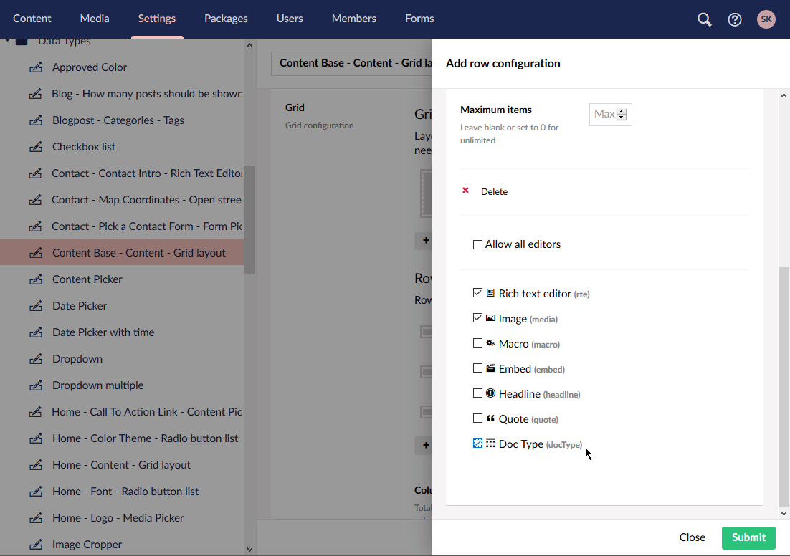
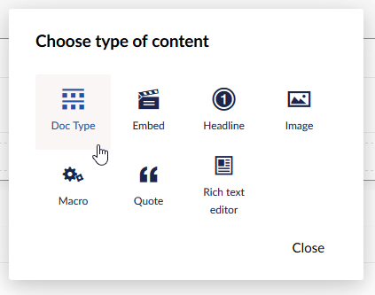
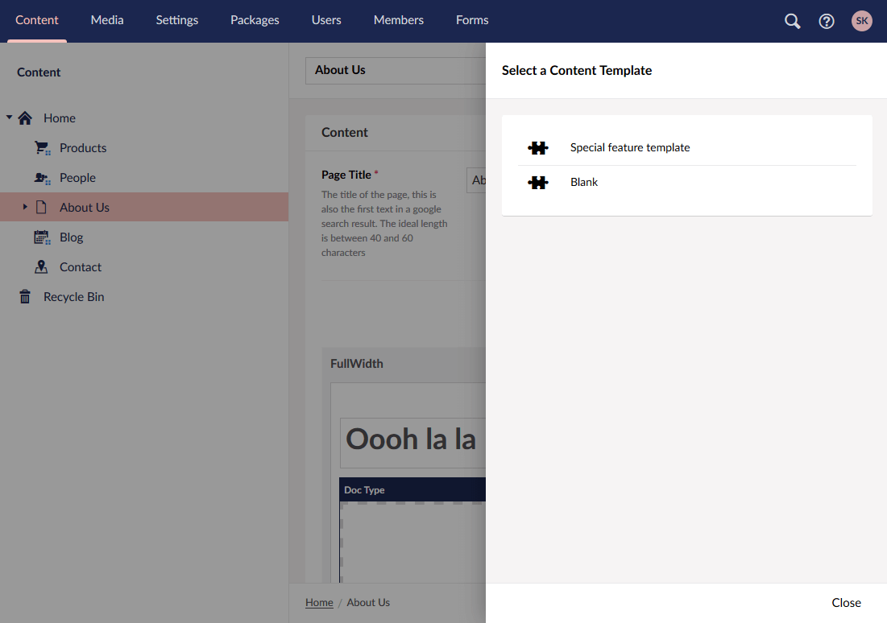
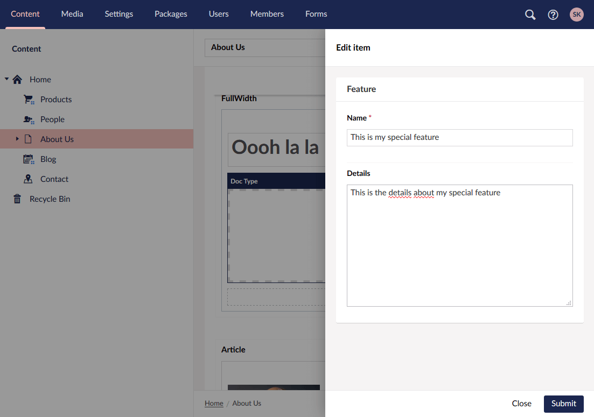
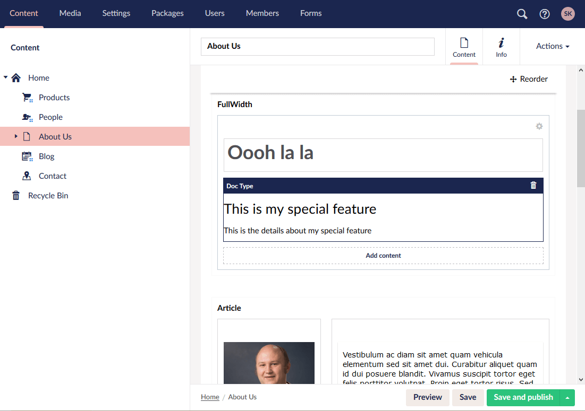
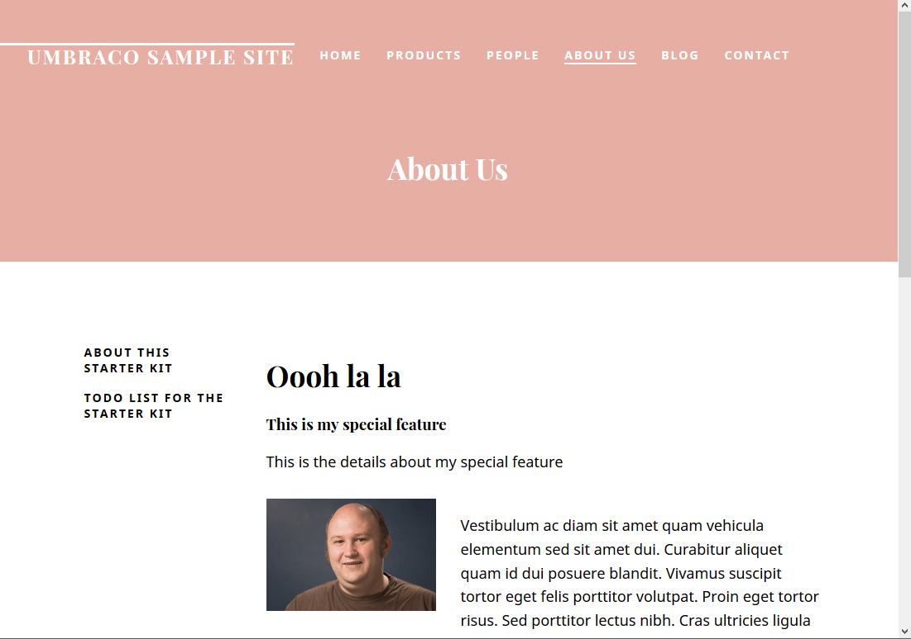

# Doc Type Grid Editor - Developers Guide

### Contents

1. [Introduction](#introduction)
2. [Getting Set Up](#getting-set-up)
    1. [System Requirements](#system-requirements)
3. [Configuring The Doc Type Grid Editor](#configuring-the-doc-type-grid-editor)
4. [Hooking Up The Doc Type Grid Editor](#hooking-up-the-doc-type-grid-editor)
5. [Rendering a Doc Type Grid Editor](#rendering-a-doc-type-grid-editor)
    1. [Rendering Alternative Preview Content](#rendering-alternative-preview-content)
    2. [DocTypeGridEditorSurfaceController](#doctypegrideditorsurfacecontroller)
6. [Useful Links](#useful-links)

---

### Introduction

**Doc Type Grid Editor** is an advanced grid editor for the new Umbraco grid, offering similar functionality as the macro grid editor but using the full power of the Doc Type editor and data types.

With the macro grid editor you are limited to only using the macro builder and thus the handful of parameter editors that are available. Of course you can create / config your own parameter editors, however this is cumbersome compared to how we can configure data types.

With the **Doc Type Grid Editor** then, we bridge that gap, allowing you to reuse doc type definitions as blue prints for complex data to be rendered in a grid cell.

---

### Getting Set Up

#### System Requirements

Before you get started, there are a number of things you will need:

1. .NET 4.7.2+
2. Umbraco 8.0.2+
3. The **Doc Type Grid Editor** package installed

---

### Configuring The Doc Type Grid Editor

The **Doc Type Grid Editor** is configured via the grid.editors.config.js config file located in the `~/Config` folder. A default configuration should be installed along with the package, but for details on the configuration options, please see below.

You can also add your editors using a package.manifest file in a folder in the `~/App_Plugins` folder.

#### Example

```javascript
[
    ...
    {
        "name": "Doc Type",
        "alias": "docType",
        "view": "/App_Plugins/DocTypeGridEditor/Views/doctypegrideditor.html",
        "render": "/App_Plugins/DocTypeGridEditor/Render/DocTypeGridEditor.cshtml",
        "icon": "icon-item-arrangement",
        "config": {
            "allowedDocTypes": [...],
            "nameTemplate": "",
            "enablePreview": true,
			"largeDialog": true,
            "viewPath": "/Views/Partials/Grid/Editors/DocTypeGridEditor/",
            "previewViewPath": "/Views/Partials/Grid/Editors/DocTypeGridEditor/Previews/",
            "previewCssFilePath": "",
            "previewJsFilePath": ""
        }
    },
    ...
]
```


For the main part, the root properties shouldn’t need to be modified, however the only properties that MUST not be changed are the **view** and **render** properties.

| Member | Type   | Description |
|--------|--------|-------------|
| Name   | String | The name of the grid editor as it appears in the grid editor prevalue editor / selector screen. |
| Alias  | String | A unique alias for this grid editor. |
| View   | String | The path to the **Doc Type Grid Editor** editor view. **MUST NOT BE CHANGED**. |
| Render | String | The path to the **Doc Type Grid Editor** render view. **MUST NOT BE CHANGED**. |
| Icon   | String | The icon class name to use for this grid editor (minus the '.') |
| Config | Object | Config options for this grid editor. |

The **Doc Type Grid Editor** supports 3 config options, all of which are optional.

| Member          | Type     | Description |
|-----------------|----------|-------------|
| AllowedDocTypes | String[] | An array of doc type aliases of which should be allowed to be selected in the grid editor. Strings can be REGEX patterns to allow matching groups of doc types in a single entry. e.g. "Widget$" will match all doc types with an alias ending in "Widget". However if a single doc type is matched, (aka **Single Doc Type Mode**), then dropdown selection stage (in the DTGE panel) will be skipped. |
| EnablePreview   | Boolean  | Enables rendering a preview of the grid cell in the grid editor. |
| LargeDialog     | Boolean  | Makes the editing dialog larger. Especially useful for grid editors with complex property editors. |
| ViewPath        | String   | Set's an alternative view path for where the **Doc Type Grid Editor** should look for views when rendering. Defaults to `~/Views/Partials/` |
| ShowDocTypeSelectAsGrid | Boolean | Makes the content type selection dialog render a grid, in stead of the default list with descriptions |

---

### Hooking Up The Doc Type Grid Editor

To hook up the **Doc Type Grid Editor**, within your grids prevalue, select the row configs you want to use the **Doc Type Grid Editor** in and for each cell config, check the **Doc Type** checkbox option to true. (NB: If you changed the name in the config, then select the item with the name you enter in the config).



With the Doc Type Grid Editor enabled, from within your grid editor, you should now have a new option in the **Insert Control** dialog.



From there, simply click the **Doc Type** icon and chose the doc type you wish to render.



Then you should be presented with a form for all the fields in your doc type.



Fill in the fields and click save. You should then see the grid populated with a preview of your item.



Make sure save / save &amp; publish the current page to persist your changes.

---

### Rendering a Doc Type Grid Editor

The **Doc Type Grid Editor** uses standard ASP.NET MVC partials as the rendering mechanism. By default it will look for partial files in `~/Views/Partials` with a name that matches the doc type alias. For example, if your doc type alias is `TestDocType`, the Doc Type Grid Editor will look for the partial file `~/Views/Partials/TestDocType.cshtml`.

To access the properties of your completed doc type, simply have your partial view inherit the standard `UmbracoViewPage` class, and you’ll be able to access them via the standard `Model` view property as a native `IPublishedContent` instance.

```
@inherits Umbraco.Web.Mvc.UmbracoViewPage
<h3>@Model.Name</h3>
```

Because we treat your data as a standard `IPublishedContent` entity, that means you can use all the property value converters you are used to using, as well as the build in `@Umbraco.Field(...)` helper methods.

```
@inherits Umbraco.Web.Mvc.UmbracoViewPage
<h3>@Model.Name</h3>
@Umbraco.Field(Model, "bodyText")
<a href="@(Model.GetPropertyValue<IPublishedContent>("link").Url)"> More</a>
```




#### Rendering Alternative Preview Content

If your front end view is rather complex, you may decide that you want to feed the back office preview an alternative, less complex view. To do this, within your Razor view/partial, check for a querystring parameter `dtgePreview` being set to "1" to detect being in preview mode to provide an alternative view.

```
@inherits Umbraco.Web.Mvc.UmbracoViewPage
@if (Request.QueryString["dtgePreview"] == "1")
{
	// Render preview view
}
else
{
	// Render front end view
}
```

#### DocTypeGridEditorSurfaceController

If you are not the type of developer that likes to put business logic in your views, then the ability to have a controller for you partial view is a must. To help with this, the **Doc Type Grid Editor** comes with a base surface controller you can used called `DocTypeGridEditorSurfaceController`.

Simply create your controller inheriting from the above class, giving it a class name of `{DocTypeAlias}SurfaceController` and an action name of `{DocTypeAlias}` and the **Doc Type Grid Editor** will automatically wire it up for you and use it at render time.

```csharp
public class TestDocTypeSurfaceController
	: DocTypeGridEditorSurfaceController
{
	public ActionResult TestDocType()
	{
		// Do your thing...
		return CurrentPartialView();
	}
}
```

By inheriting from the `DocTypeGridEditorSurfaceController` base class, you'll also have instant access to the following helper properties / methods.

| Member                                            | Type              | Description |
|---------------------------------------------------|-------------------|-------------|
| Model                                             | IPublishedElement | The IPublishedElement instance of your cell's data. |
| ViewPath                                          | String            | A reference to the currently configured ViewPath |
| CurrentPartialView(object model = null)           | Method            | Helper method to return you to the default partial view for this cell. If no model is passed in, the standard Model will be passed down. |
| PartialView(string viewName, object model = null) | Method            | Helper method to return you to an alternative partial view for this cell. If no model is passed in, the standard Model will be passed down. |

---

### Useful Links

* [Source Code](https://github.com/umco/umbraco-doc-type-grid-editor)
* [Our Umbraco Project Page](http://our.umbraco.org/projects/backoffice-extensions/doc-type-grid-editor)
